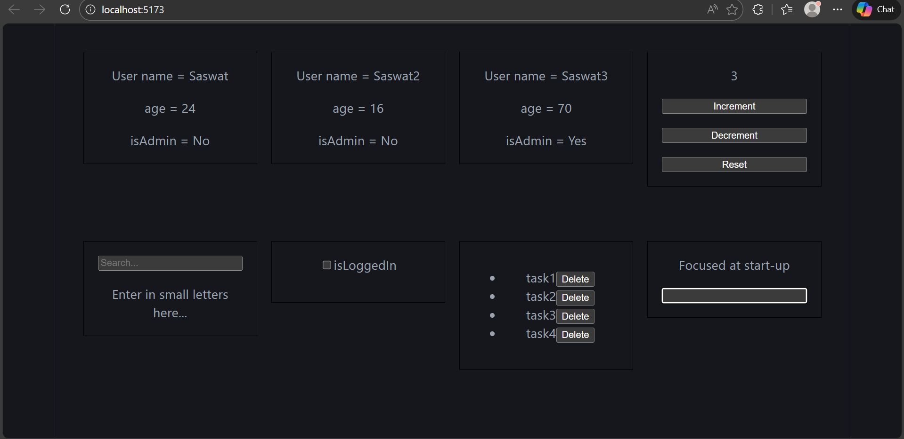
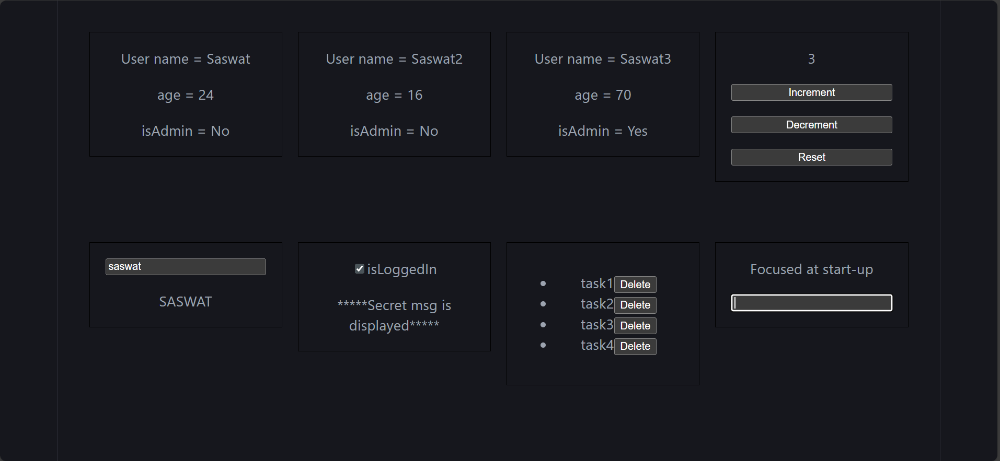

## Day 2 assignment
This is project was built using Vite with Js and React compiler

## Layout
Multiple small applications were made as per the assignment.

## Folder Structure

The project starts from the LoginApp.jsx file and global css isloaded from src/index.css

1. src/components/commons - All the components are present here.
2. The app starts from MyApp.jsx.

```bash
src/
├── assets/                 # Static assets like images, fonts, and icons
├── components/
│   └── common/             # Reusable UI components
│       ├── CounterApp.jsx  # Counter functionality logic
│       ├── Dashboard.jsx   # Main dashboard layout/view
│       ├── Focus.jsx       # Focus management or input handling
│       ├── SearchBar.jsx   # Search input component
│       ├── SecretMessage.jsx # Conditional rendering/message display
│       └── ToDo.jsx        # To-do list logic and UI
├── App.css                 # Global styles for the App component
├── App.jsx                 # Root component / App entry point
├── index.css               # Base styles (reset, typography)
├── main.jsx                # Application mounting logic (Vite/React entry)
├── MyApp.css               # Custom styles for MyApp
└── MyApp.jsx               # Alternative or secondary root component
```


## Broswer views

